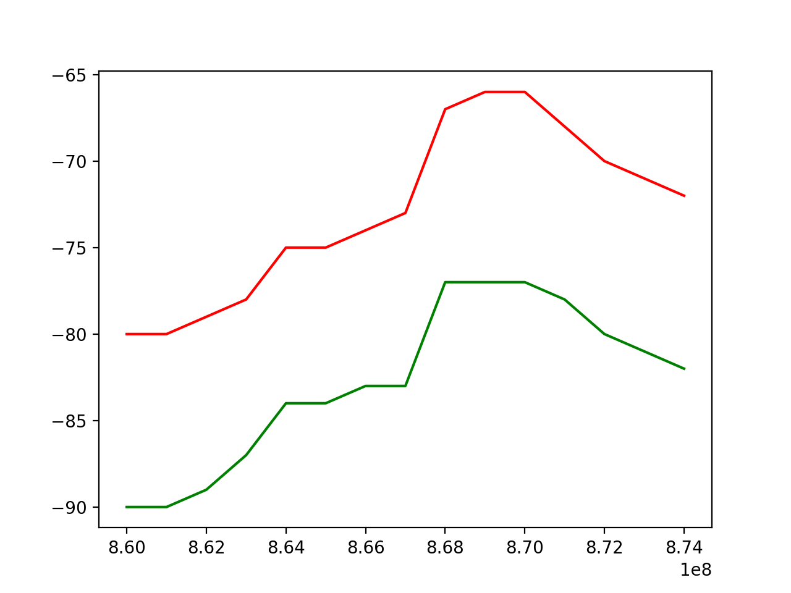

# LoRa Signal Strength Analyzer

Simple RSSI analyzer using frequency sweeping. The controller/console (Python) controls a master and a slave device (ESP32 based LoRa device like TTGO). The master sweeps accross a configurable spectrum and gathers RSSI values. After acquisition, a graph can be plotted.

The purpose of this setup is to get an idea of the performance of tranceiver devices (including antenna) under different conditions (like distance).

## example output:

